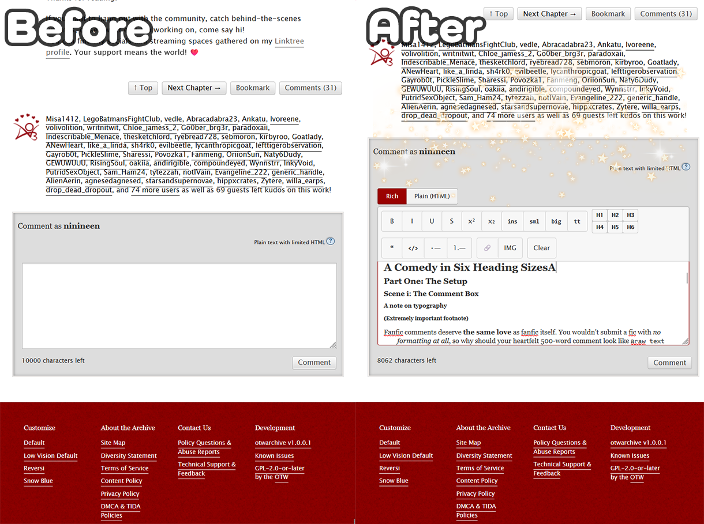

# 🧩 AO3 Rich Comment Editor

A browser extension that adds a WYSIWYG rich text editor to AO3 comment boxes: the same toggle between **Rich** and **Plain** modes that authors get in the work editor, now for commenters too.



---

### 🐛 Found a bug?

Please let me know! The best way is to [open a GitHub Issue](https://github.com/ninineen/AO3-Rich-Comment-Editor/issues/new). It needs a (free) GitHub account, but it's the easiest way for me to track and actually fix things instead of a bug report getting lost in a DM somewhere. Screenshots and the URL of the page you were on help a ton.

No GitHub account? No worries, you can still reach me through any of the links below and I'll take a look!

---

### 👩‍💻 About the developer

Hi, I'm **NiniNeen**: a Senior Frontend Engineer by day with ten years of software dev experience under my belt, and an AO3 author/VTuber by night. This extension is hand-built and maintained by me, scratching my own itch as someone who reads (and writes) very long, very formatted fic comments. See `REVIEWER_NOTES.md` for exactly what's vendored, what's first-party, and how the sanitizer works. Nothing here is a black box.

---

## 💌 Connect with me

**Support this project:** [Buy me a coffee on Ko-fi](https://ko-fi.com/ninineen)

I make AO3 skins and tools, write fanfic, stream on Twitch, and post fandom content across socials. Find me here:

<p align="left">
  <a href="https://archiveofourown.org/users/ninineen/profile" target="_blank"></a>
  <a href="https://twitch.tv/ninineen" target="_blank"></a>
  <a href="https://bsky.app/profile/ninineen.bsky.social" target="_blank"></a>
  <a href="https://ko-fi.com/ninineen" target="_blank"></a>
  <a href="https://discord.gg/ninineen" target="_blank"></a>
</p>

---

## ✨ What it does

- Injects a Squire-based rich text editor above every comment textarea on AO3
- **Rich mode:** format your comment with bold, italic, headers, lists, links, and more
- **Plain mode:** reveals the raw HTML textarea for hand-editing
- Sanitizes output to AO3's allowed HTML tags and attributes before submitting, so nothing gets silently stripped after the fact
- Works on top-level comment forms and reply boxes, including ones loaded via AJAX

## 🧰 Tech Stack & Tools

<p align="left">
  
  
  
  
  
</p>

## 📋 Allowed HTML

Matches AO3's own allowed tags: `<b>`, `<i>`, `<u>`, `<em>`, `<strong>`, `<a>`, `<blockquote>`, `<ul>`, `<ol>`, `<li>`, `<h1>`–`<h6>`, `<span>`, `<div>`, `<p>`, `<br>`, ``, `<table>`, and more. Anything AO3 would strip is sanitized out before it ever reaches the textarea.

---

## 📥 Installation

**Firefox only.** Chrome/Edge support is not planned for now.

### Firefox (signed release build)
1. Go to the [Releases page](https://github.com/ninineen/AO3-Rich-Comment-Editor/releases) and download the `.xpi` from the latest release
2. Open Firefox and go to `about:addons`
3. Click the gear icon (⚙️) near the top of the page
4. Choose **Install Add-on From File...** and select the downloaded `.xpi`
5. Confirm the install prompt. The editor now appears in AO3 comment boxes and persists across restarts

## 🧑‍💻 Installation (unpacked / developer mode)

### Firefox
1. Go to `about:debugging#/runtime/this-firefox`
2. Click **Load Temporary Add-on**
3. Select `AO3-Rich-Comment-Editor/manifest.json`
4. Note: temporary add-ons are removed when Firefox restarts. Use [web-ext](https://extensionworkshop.com/documentation/develop/getting-started-with-web-ext/) for persistent dev installs

---

## 🛠️ Development

### Setup

```bash
npm start
```

This installs dependencies, copies vendored libraries into `vendor/`, lints, and builds, all in one step.

### Scripts

| Command | What it does |
|---|---|
| `npm start` | Install → vendor → lint → build (full setup in one step) |
| `npm run vendor` | Copy pinned library files from `node_modules/` into `vendor/` |
| `npm run lint` | Validate the extension with web-ext |
| `npm run build` | Package into a submission-ready ZIP in `web-ext-artifacts/` |
| `npm run run:firefox` | Load the extension in Firefox for live testing |
| `npm run run:mobile` | Load the extension in Firefox for Android (needs `adb`, device connected/paired) for live testing |
| `npm run release` | Lint → build → sign for self-distribution (see below) |

### Reloading after changes

- **Firefox:** `npm run run:firefox` auto-reloads on file changes, or go to `about:debugging` and click **Reload**
- **Firefox for Android:** `npm run run:mobile` auto-reloads the same way, targeting a device connected via `adb` (USB or paired over Wi-Fi debugging)

### Releasing a new version

`npm run release` lints, builds, and signs the extension for the **unlisted** AMO channel: automated validation only, no public listing. It produces a permanent `.xpi` that installs in any Firefox via `about:addons` → gear icon → **Install Add-on From File**.

**One-time setup:** create a `.env` file in the project root (already git-ignored) with your [AMO API credentials](https://addons.mozilla.org/developers/addon/api/key/):
```
WEB_EXT_API_KEY=user:XXXXXXX
WEB_EXT_API_SECRET=YOUR_JWT_SECRET
```

**Every release:**

1. Make sure `CHANGELOG.md` has an `[Unreleased]` section describing what changed. If it doesn't, add one before you forget what you did.
2. Decide the new version number (semver: patch for fixes, minor for new features, major for breaking changes).
3. Bump the version in **both** `manifest.json` and `package.json`. They should always match, and AMO rejects a signing request that reuses a version number that's already been submitted.
4. Rename `CHANGELOG.md`'s `[Unreleased]` header to `[<new version>] <today's date>` (match the existing entries' format), and add a fresh empty `[Unreleased]` section above it for next time.
5. Commit the version bump + changelog update (e.g. `chore(release): bump to 1.0.1`).
6. Run:
   ```bash
   npm run release
   ```
7. Once signing succeeds, the signed `.xpi` lands in `web-ext-artifacts/`.
8. Tag the release commit: `git tag v<new version>` then `git push origin v<new version>` (or push all tags with `git push --tags`).
9. Go to [GitHub Releases](https://github.com/ninineen/AO3-Rich-Comment-Editor/releases) → **Draft a new release** → pick the tag you just pushed → paste in the relevant `CHANGELOG.md` entry as the release notes → attach the `.xpi` from `web-ext-artifacts/` → **Publish release**.

### Key files

- [`content/content.js`](content/content.js): injection logic, Squire setup, toolbar, Rich/Plain toggle, AJAX reply box detection
- [`content/sanitizer.js`](content/sanitizer.js): first-party allowlist sanitizer (loaded before `content.js`)
- [`content/content.css`](content/content.css): toggle button, toolbar, and editor styles scoped to AO3
- [`tests/`](tests/): Jest unit tests (jsdom) for the content script and sanitizer

### Vendored libraries

No bundler here: libraries are committed to `vendor/` so extension reviewers can read them directly. Versions are pinned in `package.json`, and the files are generated via `npm run vendor`.

- [Squire 2.3.2](https://github.com/fastmail/Squire) (`squire.js`): vendored unminified, with one documented 3-line patch (`vendor/squire-no-innerhtml.patch`) that removes its only dynamic `innerHTML` assignment. See `REVIEWER_NOTES.md` for details.

Sanitization is first-party: a small allowlist tree-walker in `content/sanitizer.js` restricts output to AO3-allowed tags, attributes, and http(s) URLs.

To upgrade a library: bump its version in `package.json`, run `npm install`, then `npm run vendor`, and commit the updated `vendor/` files.

### Testing manually

Load an AO3 work page, leave a comment, and click **Reply** on an existing comment to confirm AJAX reply boxes pick up the editor too.

---

## 📦 File structure

```
AO3-Rich-Comment-Editor/
├── manifest.json           # MV3 manifest (Chrome + Firefox compatible)
├── package.json            # Dev tooling (web-ext, jest)
├── .web-ext-config.mjs     # web-ext ignore rules (keeps dev files out of the XPI)
├── jest.config.js          # Jest (jsdom) test config
├── content/
│   ├── content.js          # Injection logic, Squire setup, toolbar, Rich/Plain toggle
│   ├── sanitizer.js        # First-party allowlist sanitizer (loaded before content.js)
│   └── content.css         # Toggle, toolbar, and editor styles
├── vendor/
│   ├── squire.js           # Squire 2.3.2 (bundled locally, no CDN, patched, see below)
│   └── squire-no-innerhtml.patch  # 3-line patch applied by npm run vendor
├── tests/
│   ├── content.test.js     # Unit tests for the content script
│   ├── sanitizer.test.js   # Unit tests for the sanitizer
│   └── fixtures/           # Test-only HTML fixtures
└── icons/
    └── icon-48.png         # Art by @sunsetfoam (Abstraum / Traum)
```

## 🎨 Credits

- Extension icon art by [@sunsetfoam](https://www.instagram.com/sunsetfoam), reposted with credit as per their terms. Do not reuse for commercial or political purposes.

---

<sub>💖 Made so commenters can leave just as unhinged and over-formatted a comment as the fic deserves.</sub>

<sub><sup><i>Un jour je serai de retour près de toi</i></sup></sub>
